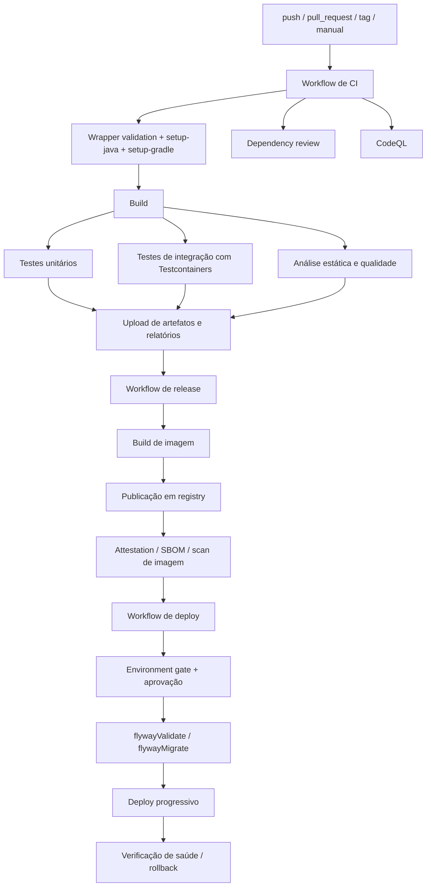
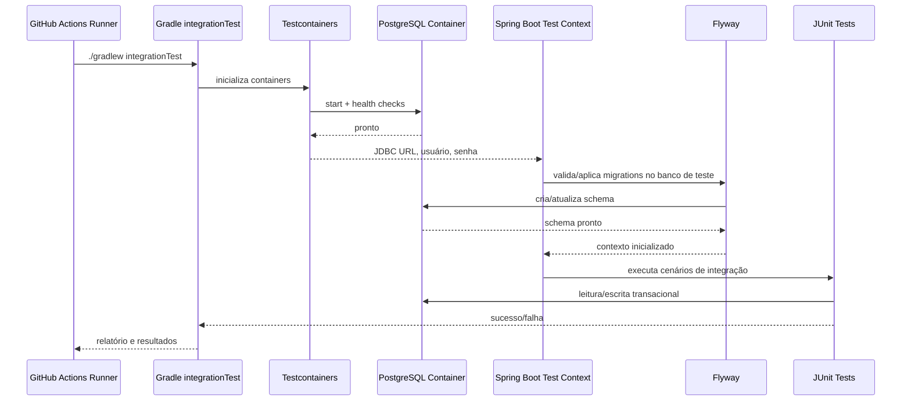

# Melhores práticas de CI/CD com GitHub Actions para Java 21, Spring Boot, Gradle, Spring AI, PostgreSQL, Flyway e Testcontainers

## Resumo executivo

Para a stack informada, a arquitetura mais robusta em GitHub Actions é separar o pipeline em trilhas com responsabilidades claras: uma trilha rápida de _pull request_ para validação de build, testes unitários, testes de integração e revisão de dependências; uma trilha de segurança dedicada para CodeQL, secret scanning e varredura de imagem; uma trilha de release para empacotar, publicar artefatos e construir imagem; e uma trilha de deploy protegida por _environments_, aprovações e autenticação federada via OIDC. GitHub suporta _reusable workflows_, permissões granulares, _artifacts_, concorrência controlada, _environment secrets_ e proteção de deploy; Gradle oferece integração oficial com GitHub Actions, _wrapper validation_, _dependency submission_, _Build Scan_ no sumário do job e caching de `GRADLE_USER_HOME`. citeturn19view1turn16view7turn17view2turn19view4turn16view1

Para os testes de integração, a recomendação principal é: use **Testcontainers como fonte de verdade para os testes da aplicação** e reserve `services:` do GitHub Actions para cenários mais simples e previsíveis, como um job dedicado a `flywayValidate`/`flywayMigrate` ou um _smoke test_ SQL explícito. Testcontainers requer um runtime compatível com Docker e é integrado ao Spring Boot via JUnit e, quando necessário, por _service connections_; o próprio ecossistema do Spring Boot documenta esse modelo de integração. Já os _service containers_ do GitHub têm diferenças de rede importantes entre jobs executados em container e jobs executados diretamente no runner. citeturn16view2turn16view3turn16view0turn5search15

Para banco de dados, Flyway deve aparecer em dois pontos: **validação em CI** e **migração controlada em deploy**. O comando `validate` detecta divergências de nome, tipo, checksum e presença/ausência de migrations; `migrate` é idempotente, cria a tabela de histórico automaticamente quando necessário e, na abordagem de migrations, é o eixo central da evolução consistente do schema. Para Java migrations e callbacks, a documentação do plugin Gradle lembra que as classes devem ser compiladas antes de executar `flywayMigrate`. citeturn26view0turn26view1turn26view2turn0search7

Em segurança, a base recomendada é: `permissions` mínimos por workflow/job, fixação de actions por SHA completo em produção, OIDC em vez de segredos cloud de longa duração, Dependabot para Gradle e para os próprios workflows, _dependency review_ em PR, CodeQL para Java/Kotlin e workflows, _artifact attestations_, _dependency verification_ do Gradle e varredura de imagem/FS com uma ferramenta de SCA/containers complementar, como Trivy. GitHub recomenda explicitamente minimizar permissões do `GITHUB_TOKEN` e fixar actions por SHA completo quando usar terceiros. citeturn17view1turn31view0turn17view2turn18view1turn18view0turn17view5turn17view3turn18view6turn22view2

Na construção de imagem, há três caminhos viáveis. O mais simples para apps Spring Boot é `bootBuildImage`, que usa Cloud Native Buildpacks e gera imagens OCI executando como não-root, mas requer acesso a um daemon Docker. Para cenários com _multi-platform_, cache remoto, metadados, SBOM e integração direta com assinaturas/atestações, `docker/build-push-action` é mais flexível. Se o objetivo for reduzir dependência de Docker no build, Jib é uma alternativa forte porque constrói imagens OCI/Docker sem daemon. citeturn16view4turn22view0turn22view1turn24search0

Como o enunciado não especifica provedor de nuvem, registry, modelo de branching, IaC, tipo de repositório público/privado, política de runners, edição do GitHub e se existem Java migrations no Flyway, o relatório abaixo explicita essas decisões como premissas ou alternativas. Onde esses detalhes alteram a recomendação, isso é dito de forma explícita.

## Premissas e arquitetura recomendada

As premissas que **não** foram especificadas e influenciam a implementação são: provedor de nuvem, registro de imagens, modelo de branches, mecanismo de IaC, política de promoção entre ambientes, necessidade de _multi-platform images_, suporte a _preview environments_, edição/licenciamento do GitHub Code Security, e se o projeto usa apenas migrations SQL ou também Java migrations/callbacks do Flyway. Esses pontos mudam detalhes operacionais, mas não mudam a espinha dorsal da arquitetura recomendada.

A arquitetura de workflows que eu recomendaria para essa stack é a seguinte:

- **`ci-pr.yml`**: roda em `push` e `pull_request`; faz checkout, `setup-java`, `setup-gradle`, build, testes unitários, testes de integração com Testcontainers, reports e _artifacts_.
- **`dependency-review.yml`**: roda em PR e falha ao introduzir dependências vulneráveis ou indesejadas.
- **`codeql.yml`**: roda em `push`, `pull_request` e `schedule` para análise de segurança de código.
- **`release-image.yml`**: roda em tag/release; publica JAR/relatórios, constrói e publica imagem container, gera atestação de procedência e, opcionalmente, SBOM.
- **`deploy.yml`**: roda manualmente (`workflow_dispatch`) ou após release; usa `environment`, OIDC, aprovações e _concurrency_ para serializar deploy por ambiente. GitHub oferece o modelo de _reusable workflows_ para evitar duplicação de YAML. citeturn19view1turn18view1turn16view6turn16view7turn19view0

A lógica operacional recomendada é: PRs devem ser rápidos e determinísticos; _deep scans_ mais caros podem ser agendados; deploy deve ser serializado por ambiente com `concurrency`; e segredos sensíveis devem ficar em `environment secrets`, só liberados para jobs que referenciem aquele ambiente aprovado. Isso aproveita diretamente `concurrency`, _deployment protection rules_, aprovações e segredos por ambiente. citeturn19view0turn16view7turn13search12turn19view2

O desenho abaixo resume essa arquitetura.



Esse fluxo é coerente com a semântica do GitHub Actions — jobs, workflows reutilizáveis, artefatos, proteção de ambientes e autenticação OIDC — e com a integração oficial do Gradle, que já cobre cache, validação do wrapper, _dependency submission_ e Build Scans no sumário do job. citeturn17view0turn19view1turn19view4turn16view7turn17view2turn16view1

## Workflows e exemplos YAML

Para os exemplos abaixo, uso _major tags_ das actions por legibilidade. Em repositório real, o ideal é **travar actions de terceiros em SHA completo**, porque o GitHub considera essa a forma imutável de consumo e a principal mitigação contra alteração maliciosa de tags. Também vale definir `permissions` mínimos e elevá-los apenas no job que realmente precisa. citeturn31view0turn17view1turn28view1

Antes do YAML, vale estruturar o Gradle para separar testes unitários e de integração. Gradle liga o `test` ao ciclo `check`, permite criar `Test` tasks próprios e executa testes em JVMs _forked_, com configuração explícita de paralelismo e isolamento. citeturn10search0turn29view1turn29view2

```kotlin
// build.gradle.kts
import org.gradle.api.tasks.testing.Test
import org.gradle.jvm.toolchain.JavaLanguageVersion

plugins {
    java
    id("org.springframework.boot") version "3.4.5"
    id("io.spring.dependency-management") version "1.1.7"
    id("org.flywaydb.flyway") version "12.9.0"
    checkstyle
}

java {
    toolchain {
        languageVersion.set(JavaLanguageVersion.of(21))
    }
}

repositories {
    mavenCentral()
}

val integrationTest by sourceSets.creating

configurations[integrationTest.implementationConfigurationName]
    .extendsFrom(configurations.testImplementation.get())
configurations[integrationTest.runtimeOnlyConfigurationName]
    .extendsFrom(configurations.testRuntimeOnly.get())

dependencies {
    testImplementation("org.springframework.boot:spring-boot-starter-test")
    testImplementation("org.testcontainers:junit-jupiter")
    testImplementation("org.testcontainers:postgresql")
    testImplementation("org.springframework.boot:spring-boot-testcontainers")

    // se houver uso de Spring AI com serviços locais/containerizados:
    // testImplementation("org.springframework.ai:spring-ai-spring-boot-testcontainers")
}

tasks.test {
    useJUnitPlatform()
    maxParallelForks = 1
}

val integrationTestTask = tasks.register<Test>("integrationTest") {
    description = "Executa testes de integração com Testcontainers."
    group = "verification"
    testClassesDirs = integrationTest.output.classesDirs
    classpath = integrationTest.runtimeClasspath
    useJUnitPlatform()
    shouldRunAfter(tasks.test)
    maxParallelForks = 1
}

tasks.check {
    dependsOn(integrationTestTask)
}
```

O workflow base de CI abaixo cobre wrapper, Java 21, cache oficial do Gradle, matriz, _artifacts_ e variáveis de ambiente. `setup-java` suporta cache nativo para Gradle, mas para builds Gradle a integração oficial com `gradle/actions/setup-gradle` é mais completa porque também restaura/salva `GRADLE_USER_HOME`, valida o wrapper e expõe Build Scan no sumário do job. citeturn21view0turn16view1turn19view6turn20view1

```yaml
# .github/workflows/ci-pr.yml
name: CI PR

on:
  push:
    branches: [main, develop]
  pull_request:
    branches: [main, develop]

permissions:
  contents: read

concurrency:
  group: ci-${{ github.workflow }}-${{ github.ref }}
  cancel-in-progress: true

env:
  JAVA_VERSION: "21"
  GRADLE_OPTS: >-
    -Dorg.gradle.daemon=false
    -Dorg.gradle.parallel=true
    -Dorg.gradle.caching=true
    -Dorg.gradle.configuration-cache=true

jobs:
  verify:
    name: Verify on ${{ matrix.os }} / JDK ${{ matrix.java }}
    runs-on: ${{ matrix.os }}
    timeout-minutes: 35
    strategy:
      fail-fast: false
      max-parallel: 2
      matrix:
        os: [ubuntu-22.04, ubuntu-24.04]
        java: [21]
        include:
          - os: ubuntu-24.04
            java: 22
            experimental: true

    continue-on-error: ${{ matrix.experimental || false }}

    steps:
      - name: Checkout
        uses: actions/checkout@v6

      - name: Set up Java
        uses: actions/setup-java@v5
        with:
          distribution: temurin
          java-version: ${{ matrix.java }}

      - name: Set up Gradle
        uses: gradle/actions/setup-gradle@v6
        with:
          dependency-graph: generate-and-submit

      - name: Compile and unit test
        run: ./gradlew --stacktrace clean test checkstyleMain checkstyleTest

      - name: Integration tests
        run: ./gradlew --stacktrace integrationTest

      - name: Upload reports
        if: always()
        uses: actions/upload-artifact@v4
        with:
          name: reports-${{ matrix.os }}-jdk${{ matrix.java }}
          path: |
            build/reports/**
            build/test-results/**
            build/libs/*.jar
          retention-days: 14
```

Quando você quiser um job explícito para validar migrations em um PostgreSQL conhecido e separado do ciclo de testes da aplicação, o padrão `services:` é simples e previsível. GitHub documenta PostgreSQL como _service container_ oficial, diferenciando o acesso via hostname de serviço quando o job roda em container, e via `localhost` + `ports` quando o job roda diretamente no runner. citeturn16view0turn28view2

```yaml
# trecho para job Flyway usando PostgreSQL service container
jobs:
  flyway-validate:
    runs-on: ubuntu-latest
    timeout-minutes: 20

    services:
      postgres:
        image: postgres:16
        env:
          POSTGRES_DB: app_ci
          POSTGRES_USER: app
          POSTGRES_PASSWORD: app
        ports:
          - 5432:5432
        options: >-
          --health-cmd="pg_isready -U app -d app_ci"
          --health-interval=10s
          --health-timeout=5s
          --health-retries=10

    env:
      FLYWAY_URL: jdbc:postgresql://localhost:5432/app_ci
      FLYWAY_USER: app
      FLYWAY_PASSWORD: app

    steps:
      - uses: actions/checkout@v6

      - uses: actions/setup-java@v5
        with:
          distribution: temurin
          java-version: '21'

      - uses: gradle/actions/setup-gradle@v6

      - name: Validate migrations
        run: ./gradlew --stacktrace flywayValidate

      - name: Apply migrations in CI database
        run: ./gradlew --stacktrace flywayMigrate
```

Para build e publicação de imagem, o workflow abaixo usa Docker Buildx, metadados, publicação de imagem e atestação. O GitHub documenta a publicação de imagens via Actions, e o Docker documenta que `docker/build-push-action` oferece cache remoto, _multi-platform_, _secrets_ e _attestations_. Para container images, as atestações do GitHub exigem `id-token: write`, `attestations: write` e, em geral, `packages: write`. citeturn16view6turn22view0turn17view4

```yaml
# .github/workflows/release-image.yml
name: Release Image

on:
  push:
    tags:
      - "v*.*.*"

permissions:
  contents: read
  packages: write
  id-token: write
  attestations: write

env:
  REGISTRY: ghcr.io
  IMAGE_NAME: ${{ github.repository }}

jobs:
  image:
    runs-on: ubuntu-latest
    timeout-minutes: 40

    steps:
      - uses: actions/checkout@v6

      - uses: actions/setup-java@v5
        with:
          distribution: temurin
          java-version: '21'

      - uses: gradle/actions/setup-gradle@v6

      - name: Build application
        run: ./gradlew --stacktrace clean build

      - name: Log in to registry
        uses: docker/login-action@v3
        with:
          registry: ${{ env.REGISTRY }}
          username: ${{ github.actor }}
          password: ${{ secrets.GITHUB_TOKEN }}

      - name: Extract metadata
        id: meta
        uses: docker/metadata-action@v6
        with:
          images: ${{ env.REGISTRY }}/${{ env.IMAGE_NAME }}

      - name: Build and push
        id: push
        uses: docker/build-push-action@v7
        with:
          context: .
          push: true
          provenance: mode=max
          sbom: true
          tags: ${{ steps.meta.outputs.tags }}
          labels: ${{ steps.meta.outputs.labels }}

      - name: Generate artifact attestation
        uses: actions/attest@v4
        with:
          subject-name: ${{ env.REGISTRY }}/${{ env.IMAGE_NAME }}
          subject-digest: ${{ steps.push.outputs.digest }}
          push-to-registry: true
```

Se você preferir eliminar Docker daemon do build da imagem, Jib é uma alternativa válida para Java/Gradle e constrói imagens OCI/Docker sem daemon. Se preferir empacotamento idiomático do Spring Boot, `bootBuildImage` é excelente, mas depende de um daemon Docker acessível ao job. citeturn24search0turn16view4

## Testcontainers e Flyway em CI e deploy

Para Testcontainers em GitHub Actions, a melhor estratégia, para a maioria dos projetos Java/Spring Boot, é **executar o job diretamente em um runner Ubuntu** e deixar o teste iniciar os próprios containers. Isso reduz atrito de rede e evita o overhead adicional de colocar o build inteiro dentro de um container de job. O requisito central do Testcontainers é um runtime compatível com Docker; no GitHub Actions, _container jobs_ e _service containers_ exigem Linux, e em self-hosted Linux o Docker precisa estar instalado. citeturn16view2turn16view0turn29view0

Quando os testes usam a extensão JUnit 5 do Testcontainers, **campos estáticos** anotados com `@Container` são compartilhados entre os métodos de teste da classe; **campos de instância** são reiniciados a cada método. A própria documentação avisa que a integração JUnit 5 do Testcontainers foi testada para execução sequencial e não suporta paralelismo do JUnit extension sem riscos de efeitos colaterais. Isso é importante para CI: antes de aumentar paralelismo, estabilize isolamento de testes. citeturn30view2

Se você tiver mais de um container em um mesmo teste — por exemplo, PostgreSQL + um serviço auxiliar de IA local, ou PostgreSQL + um broker — vale usar `Startables.deepStart(...).join()` para inicialização paralela dos containers e reduzir overhead de startup. No lado do Gradle, o paralelismo do processo de testes fica sob `maxParallelForks`, que deve crescer com prudência porque testes paralelos precisam ser realmente isolados. citeturn30view0turn29view1

A sequência típica dos testes de integração para essa stack fica assim:



A comparação prática entre `services:`, Testcontainers e DinD é a seguinte:

| Opção | Quando usar | Vantagens | Custos e riscos | Recomendação |
|---|---|---|---|---|
| `services:` do GitHub Actions | Job de migrations, _smoke tests_, banco compartilhado por um job | Configuração simples; integração nativa do Actions; hostname ou `localhost` bem definidos conforme o tipo de job. citeturn16view0turn28view2 | Menor paridade com a lógica real do teste; menos controle por teste/classe; fácil confundir com o banco do Testcontainers. | **Bom para Flyway job e smoke tests; não como substituto principal do Testcontainers.** |
| Testcontainers | Testes de integração da aplicação | Ciclo de vida no próprio teste; integração oficial com Spring Boot; containers descartáveis; excelente paridade dev/CI. citeturn16view3turn16view2turn14search3 | Startup mais caro; exige runtime Docker; extensão JUnit 5 do Testcontainers não é suportada para execução paralela sem cuidado. citeturn30view2 | **Escolha principal para testes de integração.** |
| Job dentro de container + “wormhole” / DinD | Quando o build inteiro precisa rodar dentro de container | Viabiliza pipelines altamente containerizados. citeturn30view3 | Requer _socket mount_ ou DinD; mais complexidade; Testcontainers chama DinD de “instrumento de último recurso”. citeturn30view3 | **Evite como padrão; use só se houver necessidade real.** |

Para Flyway, a prática mais segura é dividir em dois níveis. **Em CI**, rode `flywayValidate` sempre que houver alterações em `db/migration`, e opcionalmente `flywayMigrate` contra um banco efêmero do job para provar que a sequência de migrations é aplicável. **No deploy**, execute `flywayMigrate` no ambiente alvo pouco antes da promoção de tráfego, ou no startup controlado da aplicação, desde que haja coordenação explícita para evitar corrida entre múltiplos pods/instâncias. `validate` verifica checksums, nomes, tipos e versões pendentes/aplicadas; `migrate` é idempotente e cria a tabela de histórico quando necessário. citeturn26view0turn26view1turn26view2

Um detalhe crítico: se o projeto usa **Java migrations** ou callbacks Java, o plugin Gradle do Flyway exige compilação prévia das classes; por isso, o fluxo correto é algo como `./gradlew classes flywayMigrate` em vez de chamar `flywayMigrate` “nu” em alguns cenários. citeturn0search7

Os comandos mais úteis para CI/CD desta stack são estes:

```bash
# validação rápida
./gradlew clean test checkstyleMain checkstyleTest

# suíte completa
./gradlew clean test integrationTest check

# validação de migrations
./gradlew flywayValidate

# aplicação de migrations em banco efêmero de CI
./gradlew flywayMigrate

# se houver Java migrations/callbacks
./gradlew classes flywayMigrate

# build do artefato
./gradlew bootJar

# imagem OCI via Spring Boot Buildpacks
./gradlew bootBuildImage

# Build Scan e stacktrace em diagnóstico
./gradlew build --scan --stacktrace
```

E um _shell snippet_ útil para aguardar disponibilidade do PostgreSQL em jobs com `services:`:

```bash
#!/usr/bin/env bash
set -euo pipefail

for i in {1..30}; do
  if pg_isready -h localhost -p 5432 -U app -d app_ci; then
    echo "PostgreSQL pronto"
    exit 0
  fi
  echo "Aguardando PostgreSQL..."
  sleep 2
done

echo "PostgreSQL não ficou pronto a tempo" >&2
exit 1
```

Se o projeto passar a usar serviços locais de IA ou _vector stores_ em teste, o módulo `spring-ai-spring-boot-testcontainers` passa a ser útil, porque o Spring AI documenta _auto-configuration_ para conexões com model services e vector stores rodando por Testcontainers. citeturn25view0

## Segurança e supply chain

A política de segurança do pipeline deve começar em `permissions`. O GitHub recomenda que o `GITHUB_TOKEN` tenha, por padrão, apenas o mínimo necessário — idealmente `contents: read` — e que permissões adicionais sejam abertas apenas no job específico que precisa publicar pacote, escrever atestação, subir resultado de scan ou obter `id-token`. Além disso, quando um workflow define qualquer permissão explicitamente, as não especificadas passam para `none`, o que é importante para evitar privilégios “accidentais”. citeturn17view1turn28view1

Para autenticação em cloud, a recomendação preferencial é **OIDC**. O GitHub descreve OIDC como mecanismo para trocar credenciais longas em segredos por tokens curtos emitidos diretamente pelo provedor cloud durante o job. Isso reduz duplicação de credenciais, melhora o controle fino de autorização e diminui superfície de rotação manual. Em um deploy moderno, `AWS/GCP/Azure/Vault` devem ser acessados via OIDC, não via `CLOUD_ACCESS_KEY` persistida em segredo de repositório. citeturn17view2

Para segredos, a regra é simples: use **secrets** para dados sensíveis e **variables** para configuração não sensível. GitHub distingue bem esses papéis. Além disso, segredos de ambiente só ficam disponíveis para jobs que referenciam aquele ambiente; se houver aprovação obrigatória, o job não acessa os segredos antes dela. Em runners self-hosted, porém, o GitHub alerta que os jobs não rodam em um container isolado por padrão; portanto, _environment secrets_ devem ser tratados com o mesmo rigor de segredos organizacionais e de repositório. citeturn19view2turn19view3turn16view7

Em revisão de dependências, combine três camadas. A primeira é **`dependency review` em pull request**, para detectar adição de dependências inseguras, antigas, sem licença desejada ou com problemas já conhecidos. A segunda é **`dependency submission`** do Gradle, que alimenta o GitHub Dependency Graph e habilita alertas e recursos de supply chain. A terceira é **Dependabot**, tanto para Gradle quanto para as próprias actions. O GitHub documenta explicitamente o ecossistema `"github-actions"` em `dependabot.yml` para manter `.github/workflows` atualizados. citeturn17view5turn16view1turn18view5

Para análise estática de segurança, **CodeQL** é a escolha padrão dentro do ecossistema GitHub. Ele suporta `java-kotlin` e também workflows do GitHub Actions. Ainda mais importante: o GitHub recomenda executar scans em `push`, `pull_request` e também em `schedule`, porque o scan agendado captura novas descobertas de vulnerabilidades mesmo sem mudança recente de código. citeturn18view0turn18view1

Para _container scanning_ e SCA complementar, um padrão comum é Trivy como varredura de filesystem e imagem. A action oficial documenta cache próprio para base de vulnerabilidades e Java DB; a ferramenta também documenta cache por ID/layers da imagem, o que ajuda bastante no custo do pipeline. Se você publicar imagens, faz sentido rodar Trivy no digest recém-gerado, logo antes do deploy. citeturn22view2turn22view3

No lado de integridade da cadeia de build, o par mais importante é **_artifact attestations_ + SBOM/proveniência**. O GitHub documenta atestações que estabelecem procedência de build para binários e imagens; o Docker documenta SBOM e _provenance attestations_ no `docker/build-push-action`. Para repositórios privados, vale explicitar `provenance: mode=max` e `sbom: true` quando o processo de release exigir rastreabilidade forte. citeturn17view3turn17view4turn22view1

No Gradle, duas práticas de hardening merecem entrar na baseline. A primeira é o **Gradle Wrapper** como forma padrão de execução, com validação automática do `gradle-wrapper.jar` via `setup-gradle`. A segunda é **dependency verification**, que habilita verificação automática de checksums/assinaturas de dependências em cada build por meio de `gradle/verification-metadata.xml`. citeturn11search1turn19view5turn18view6

Uma configuração mínima de `dependabot.yml` ficaria assim:

```yaml
# .github/dependabot.yml
version: 2
updates:
  - package-ecosystem: "gradle"
    directory: "/"
    schedule:
      interval: "weekly"

  - package-ecosystem: "github-actions"
    directory: "/"
    schedule:
      interval: "weekly"
```

E um workflow curto de _dependency review_ em PR:

```yaml
# .github/workflows/dependency-review.yml
name: Dependency Review

on:
  pull_request:

permissions:
  contents: read

jobs:
  dependency-review:
    runs-on: ubuntu-latest
    steps:
      - uses: actions/checkout@v6
      - uses: actions/dependency-review-action@v4
```

Por fim, um ponto específico da stack: o Spring AI documenta observabilidade para `ChatClient`, `ChatModel`, `EmbeddingModel`, `ImageModel` e `VectorStore`, e também deixa claro que _prompt_ e _completion_ **não são exportados por padrão**; isso é bom para segurança. Em CI, o correto é manter logging de prompts/completions desligado e jamais vazar API keys de provedores LLM em PRs abertos. citeturn25view2

## Performance e custos

O principal acelerador para Gradle em GitHub Actions é **`gradle/actions/setup-gradle`**, não apenas por cache, mas porque ele já integra cache de `GRADLE_USER_HOME`, validação do wrapper, Build Scan no job summary e _dependency submission_. Em seguida vêm **configuration cache**, **build cache**, **incremental build** e desenho correto das tasks. Gradle explica que o configuration cache pula toda a fase de configuração em hits, enquanto o incremental build permite que tasks fiquem `UP-TO-DATE` quando inputs/outputs não mudam. citeturn16view1turn19view6turn20view1

Para custo, o maior erro é misturar tudo em um único workflow pesado em toda alteração. O desenho economicamente eficiente costuma ser:

- PR: build, unit test, integration test, dependency review, quality checks.
- Push na branch principal: o mesmo + publicação de artefatos intermediários.
- Schedule noturno: CodeQL completo, Trivy aprofundado, matriz expandida, testes experimentais.
- Tag/release: build de imagem, push, atestação, deploy. citeturn18view1turn16view6turn17view4

Também vale usar `concurrency` para cancelar execuções obsoletas em branches ativas. GitHub documenta `cancel-in-progress: true` como forma de evitar gasto com runs supersedidos. Em repositórios com muitos pushes na mesma PR, isso economiza minutos de forma direta. citeturn19view0

Para os testes, há dois eixos de paralelismo que precisam ser coordenados: o **paralelismo do matrix/job** em GitHub Actions e o **paralelismo intra-job** do Gradle (`maxParallelForks`). Se você aumenta ambos sem governança, Testcontainers e PostgreSQL podem competir por CPU/memória e piorar _throughput_. Comece com `strategy.max-parallel` baixo e `maxParallelForks = 1` nos testes de integração; depois aumente com medição. GitHub e Gradle documentam exatamente esses controles. citeturn29view0turn29view1

A tabela abaixo resume a escolha entre runners:

| Opção | Características | Quando faz sentido | Limitações / riscos | Base oficial |
|---|---|---|---|---|
| GitHub-hosted padrão | Em repositórios públicos, `ubuntu-latest` roda em VM Linux com 4 CPU / 16 GB RAM / 14 GB SSD; em privados, `ubuntu-latest` padrão é 2 CPU / 8 GB RAM / 14 GB SSD. citeturn27view1turn27view2 | Times pequenos/médios, baixa manutenção, arranque imediato | Menos controle de rede, IPs dinâmicos, custo por minuto em repositórios privados. citeturn27view1 | citeturn27view1turn27view2 |
| GitHub-hosted larger runners | Mais CPU/RAM/SSD, IP estático, autoscaling, runner groups; exemplos Ubuntu: 2 CPU / 8 GB / 75 GB, 4 CPU / 16 GB / 150 GB, 8 CPU / 32 GB / 300 GB. citeturn4search3turn27view3turn27view4 | Builds pesados, Testcontainers múltiplos, restrições de allowlist, alto paralelismo | Disponível só em Team/Enterprise; ainda é custo de serviço gerenciado. citeturn4search3turn4search15 | citeturn27view3turn27view4 |
| Self-hosted | Ambiente totalmente customizável; pode ficar perto da infra e registries privados. citeturn4search2turn4search7 | Grandes volumes, necessidade de rede privada, cache persistente, alto throughput | GitHub recomenda autoscaling com **ephemeral runners**, não persistentes; repositórios públicos com forks são arriscados. citeturn17view7turn4search12turn4search18 | citeturn17view7turn4search12 |

Se você quiser ir além, duas otimizações têm ótimo ROI:

- **Remote build cache do Gradle** para outputs reusáveis entre runners, especialmente útil em self-hosted ou em um conjunto fixo de larger runners. Gradle suporta cache HTTP com leitura/escrita controladas. citeturn20view0
- **Artifacts bem selecionados**: suba apenas JAR, relatórios de testes, relatórios de qualidade e manifests de release. Artefato demais aumenta armazenamento e tempo de upload/download. GitHub fornece artefatos para compartilhamento entre jobs e persistência pós-run. citeturn19view4

## Estratégias de deploy e opções de target

Sem restrição de provedor, eu escolheria a estratégia de deploy a partir do grau de controle operacional desejado.

Em **Kubernetes**, o caminho padrão é **rolling update** com readiness/liveness/startup probes bem configuradas. Kubernetes documenta que rolling update pode acontecer sem downtime ao substituir Pods gradualmente e só enviar tráfego a Pods capazes de atender requests. Isso faz K8s ser a opção mais flexível para times que já operam orquestração e desejam máximo controle sobre rollout, rollback e políticas de saúde. citeturn22view4turn32search15turn32search16

Em **Amazon ECS**, a escolha forte é **blue/green** quando seu foco é reduzir risco com troca de tráfego controlada e rollback rápido. A documentação da AWS descreve blue/green em ECS como duas revisões lado a lado, com validação antes de mandar tráfego de produção. Isso é excelente para workloads com exigência forte de previsibilidade e rollback. citeturn22view5

Em **Cloud Run**, a vantagem está na simplicidade operacional combinada com **traffic splitting** entre revisões. A documentação do Google Cloud descreve explicitamente divisão percentual de tráfego, rollout gradual e rollback para revisão anterior. Para equipes que querem baixo esforço operacional com canário real em produção, Cloud Run é muito atraente. citeturn22view6

Em **VMs**, a estratégia mais prática é operar duas pools/grupos atrás de um balanceador e promover tráfego no load balancer, ou usar uma plataforma de rollout da nuvem — por exemplo, CodeDeploy no caso AWS EC2/On-Premises. O custo operacional é mais alto, mas a flexibilidade também. É a alternativa adequada quando a organização precisa de controle muito fino sobre sistema operacional, sidecars não padronizados, agentes legados ou dependências não triviais de containerização. citeturn23search7turn23search16turn12search3

A comparação resumida fica assim:

| Target | Estratégia mais natural | Pontos fortes | Trade-offs | Base oficial |
|---|---|---|---|---|
| Kubernetes | Rolling update nativo; blue/green/canary exigem estratégia adicional de tráfego | Máximo controle, ecossistema rico, ótimo para workloads intensivos e padronizados em container | Maior complexidade operacional | citeturn22view4turn32search15turn32search9 |
| Amazon ECS | Blue/green muito bem suportado | Menor esforço que K8s; rollback previsível; bom equilíbrio entre controle e managed service | Acoplamento maior ao ecossistema AWS | citeturn22view5 |
| Cloud Run | Canary/gradual rollout por traffic splitting entre revisões | Operação simples, rollback rápido, ótimo para APIs stateless | Menos controle de baixo nível que K8s/VM | citeturn22view6 |
| VM | Blue/green ou rolling via load balancer / ferramenta de deploy | Máxima liberdade de SO/processos/legado | Maior carga operacional e padronização mais difícil | citeturn23search7turn23search16turn12search3 |

Do ponto de vista de pipeline, eu adotaria estas regras:

- **Staging**: deploy automático após release candidate aprovado.
- **Production**: deploy serializado por `concurrency`, aprovações por `environment`, health checks e rollback automático/manual.
- **Flyway**: `validate` antes do deploy e `migrate` imediatamente antes da promoção de tráfego, com governança para evitar múltiplas instâncias aplicando migrations simultaneamente.
- **AI providers**: testes com provedores reais de IA apenas em ambiente protegido, preferencialmente como _smoke tests_ controlados, não em toda PR.

Exemplos de comandos por target:

```bash
# Kubernetes
kubectl set image deployment/app app=ghcr.io/org/app:${GIT_SHA}
kubectl rollout status deployment/app --timeout=180s

# ECS
aws ecs update-service \
  --cluster my-cluster \
  --service my-service \
  --force-new-deployment

# Cloud Run
gcloud run deploy app \
  --image ghcr.io/org/app:${GIT_SHA} \
  --region us-central1

# VM genérica via SSH
scp build/libs/app.jar deploy@server:/opt/app/app.jar
ssh deploy@server 'sudo systemctl restart app && sudo systemctl status app --no-pager'
```

## Checklist de implementação e template final

Antes de “ligar” o pipeline em produção, este é o checklist essencial:

- Definir `build.gradle.kts` com `toolchain` Java 21, `integrationTest` separado e `check` agregando validação.
- Padronizar `./gradlew` e ativar `setup-gradle`.
- Habilitar `dependency review`, Dependabot e CodeQL.
- Colocar segredos cloud fora do GitHub quando possível, usando OIDC.
- Criar `environments` para `staging` e `production`, com aprovadores, branches permitidas e _concurrency_.
- Separar testes unitários e Testcontainers.
- Usar `services:` apenas para jobs específicos de migrations/smoke, não como substituto de Testcontainers.
- Publicar apenas artefatos úteis.
- Habilitar varredura de imagem e atestação de procedência no release.
- Definir política de rollback por target.
- Em produção, fixar actions por SHA completo e proteger `.github/workflows` com `CODEOWNERS`. citeturn16view1turn17view5turn18view5turn18view1turn17view2turn16view7turn31view0

O template abaixo é um **workflow único e pronto para uso** como base consolidada. Ele privilegia simplicidade operacional, mantendo boa separação de responsabilidades. Em times maiores, eu o quebraria em _reusable workflows_ (`workflow_call`) depois.

```yaml
# .github/workflows/ci-cd.yml
name: Java CI CD

on:
  push:
    branches: [main, develop]
    tags:
      - "v*.*.*"
  pull_request:
    branches: [main, develop]
  workflow_dispatch:
    inputs:
      deploy_target:
        description: "Ambiente de deploy"
        required: true
        default: "staging"
        type: choice
        options:
          - staging
          - production

permissions:
  contents: read

concurrency:
  group: ${{ github.workflow }}-${{ github.ref }}
  cancel-in-progress: true

env:
  JAVA_VERSION: "21"
  REGISTRY: ghcr.io
  IMAGE_NAME: ${{ github.repository }}
  GRADLE_OPTS: >-
    -Dorg.gradle.daemon=false
    -Dorg.gradle.parallel=true
    -Dorg.gradle.caching=true
    -Dorg.gradle.configuration-cache=true

jobs:
  build-and-unit-test:
    runs-on: ubuntu-latest
    timeout-minutes: 30

    steps:
      - uses: actions/checkout@v6

      - uses: actions/setup-java@v5
        with:
          distribution: temurin
          java-version: ${{ env.JAVA_VERSION }}

      - uses: gradle/actions/setup-gradle@v6
        with:
          dependency-graph: generate-and-submit

      - name: Build + unit tests + static checks
        run: ./gradlew --stacktrace clean test checkstyleMain checkstyleTest bootJar

      - name: Upload JAR and test reports
        if: always()
        uses: actions/upload-artifact@v4
        with:
          name: app-build
          path: |
            build/libs/*.jar
            build/reports/**
            build/test-results/**
          retention-days: 14

  integration-test:
    runs-on: ubuntu-latest
    timeout-minutes: 35
    needs: build-and-unit-test

    steps:
      - uses: actions/checkout@v6

      - uses: actions/setup-java@v5
        with:
          distribution: temurin
          java-version: ${{ env.JAVA_VERSION }}

      - uses: gradle/actions/setup-gradle@v6

      - name: Run integration tests with Testcontainers
        run: ./gradlew --stacktrace integrationTest

      - name: Upload integration reports
        if: always()
        uses: actions/upload-artifact@v4
        with:
          name: integration-reports
          path: |
            build/reports/**
            build/test-results/**
          retention-days: 14

  flyway-validate:
    runs-on: ubuntu-latest
    timeout-minutes: 20
    needs: build-and-unit-test

    services:
      postgres:
        image: postgres:16
        env:
          POSTGRES_DB: app_ci
          POSTGRES_USER: app
          POSTGRES_PASSWORD: app
        ports:
          - 5432:5432
        options: >-
          --health-cmd="pg_isready -U app -d app_ci"
          --health-interval=10s
          --health-timeout=5s
          --health-retries=10

    env:
      FLYWAY_URL: jdbc:postgresql://localhost:5432/app_ci
      FLYWAY_USER: app
      FLYWAY_PASSWORD: app

    steps:
      - uses: actions/checkout@v6

      - uses: actions/setup-java@v5
        with:
          distribution: temurin
          java-version: ${{ env.JAVA_VERSION }}

      - uses: gradle/actions/setup-gradle@v6

      - name: Validate migrations
        run: ./gradlew --stacktrace flywayValidate

      - name: Apply migrations on CI database
        run: ./gradlew --stacktrace flywayMigrate

  dependency-review:
    if: github.event_name == 'pull_request'
    runs-on: ubuntu-latest
    timeout-minutes: 10

    steps:
      - uses: actions/checkout@v6
      - uses: actions/dependency-review-action@v4

  image:
    if: startsWith(github.ref, 'refs/tags/v')
    runs-on: ubuntu-latest
    timeout-minutes: 40
    needs:
      - build-and-unit-test
      - integration-test
      - flyway-validate
    permissions:
      contents: read
      packages: write
      id-token: write
      attestations: write

    outputs:
      digest: ${{ steps.push.outputs.digest }}

    steps:
      - uses: actions/checkout@v6

      - name: Log in to GHCR
        uses: docker/login-action@v3
        with:
          registry: ${{ env.REGISTRY }}
          username: ${{ github.actor }}
          password: ${{ secrets.GITHUB_TOKEN }}

      - name: Extract image metadata
        id: meta
        uses: docker/metadata-action@v6
        with:
          images: ${{ env.REGISTRY }}/${{ env.IMAGE_NAME }}

      - name: Build and push image
        id: push
        uses: docker/build-push-action@v7
        with:
          context: .
          push: true
          provenance: mode=max
          sbom: true
          tags: ${{ steps.meta.outputs.tags }}
          labels: ${{ steps.meta.outputs.labels }}

      - name: Generate artifact attestation
        uses: actions/attest@v4
        with:
          subject-name: ${{ env.REGISTRY }}/${{ env.IMAGE_NAME }}
          subject-digest: ${{ steps.push.outputs.digest }}
          push-to-registry: true

  image-scan:
    if: startsWith(github.ref, 'refs/tags/v')
    runs-on: ubuntu-latest
    timeout-minutes: 20
    needs: image

    steps:
      - name: Scan image with Trivy
        uses: aquasecurity/trivy-action@v0.36.0
        with:
          scan-type: image
          image-ref: ${{ env.REGISTRY }}/${{ env.IMAGE_NAME }}@${{ needs.image.outputs.digest }}
          format: table
          exit-code: "1"
          severity: CRITICAL,HIGH

  deploy:
    if: >
      startsWith(github.ref, 'refs/tags/v') ||
      github.event_name == 'workflow_dispatch'
    runs-on: ubuntu-latest
    timeout-minutes: 30
    needs:
      - image
      - image-scan
    environment:
      name: ${{ github.event.inputs.deploy_target || 'staging' }}
    concurrency:
      group: deploy-${{ github.event.inputs.deploy_target || 'staging' }}
      cancel-in-progress: false
    permissions:
      contents: read
      id-token: write

    steps:
      - uses: actions/checkout@v6

      # Exemplo: autenticação via OIDC no provedor cloud
      # Substitua pelo action oficial do seu provedor

      - name: Echo release coordinates
        run: |
          echo "Deploy target: ${{ github.event.inputs.deploy_target || 'staging' }}"
          echo "Image digest: ${{ needs.image.outputs.digest }}"

      # Exemplo genérico para o seu target:
      # - Kubernetes: kubectl set image / kubectl rollout status
      # - ECS: aws ecs update-service --force-new-deployment
      # - Cloud Run: gcloud run deploy ...
      # - VM: ssh/scp/systemctl

      - name: Placeholder deploy
        run: |
          echo "Implemente aqui o deploy para Kubernetes, ECS, Cloud Run ou VM."
          echo "Mantenha flywayValidate antes do tráfego e flywayMigrate imediatamente antes da promoção."
```

Como baseline final, minha recomendação objetiva é esta: **PR rápido + Testcontainers como padrão de integração + Flyway validado em banco efêmero + release com imagem atestada + deploy protegido por environment e OIDC**. Para esta stack específica, esse desenho oferece o melhor equilíbrio entre confiabilidade, segurança, custo e previsibilidade operacional. citeturn16view3turn26view0turn17view4turn16view7turn17view2